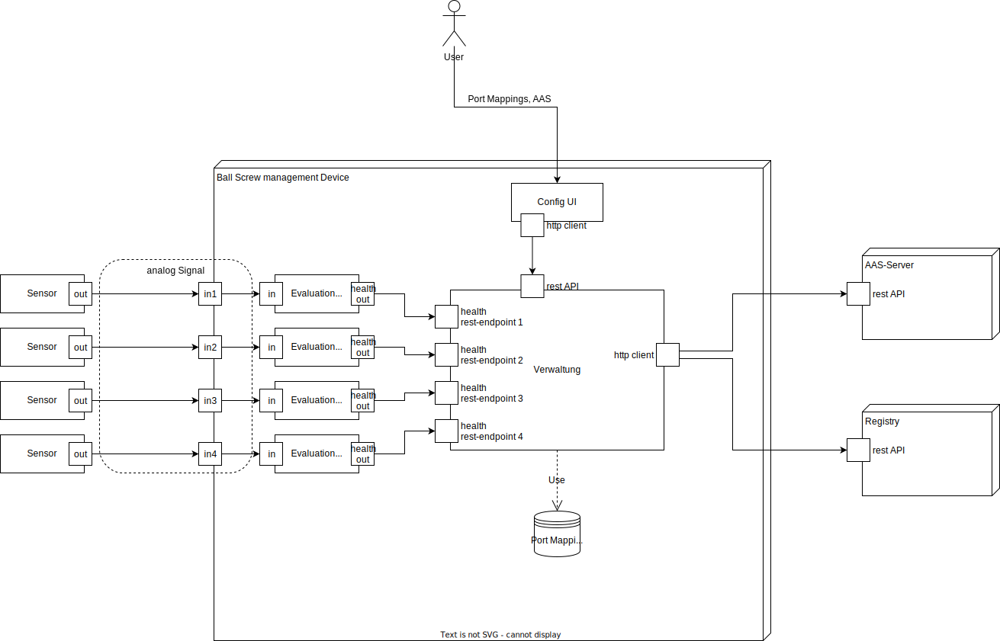

# BaSys KGT Management Application

Application for managing the BaSys integration of a Ball Screw.

Part of the BaSys4Maintain Satellite project.

Java / Spring-Boot Application.

The application can manage multiple ball-screws and register them with the BaSyx 4.0 infrastructure. A BaSyx AAS server and registry can also be started with the
applications included docker-compose file (see Installation & set-up). The management application can be used to manage the AAS of multiple ballscrews. This includes
registration and upload, deregistration and deletion, and forwarding health values from an external health-monitoring device.

# System Environment

The application is meant to be run in conjunction with a complete BaSyx Infrastructure. [BaSyx](https://www.eclipse.org/basyx/) is an implementation of digital twins and industry automation in the form of Asset Administration Shells. A simple way to start a preconfigured BaSyx AAS Server and Registry for testing purposes is provided with the docker-compose file included in this project.

In Addition to the BaSyx servers you need sensors and evaluators that measure the health value of your ball Screws an use the appropriate POST /api/health endpoint of this application to notify the management application of the health value. The management application will then write the health value to the asset administration shell.

# API

The OpenApi UI and documentation can be found at http://localhost:8080/swagger-ui/index.html when the server is running.

# Installation and set-up

## Requirements

- Docker (https://www.docker.com/)
- maven
- Internet connection (or pre-downloaded docker images)
- example AAS can be found in the AAS folder

## Set-up

1. open a terminal in the application folder
2. execute `docker compose -f docker-compose-basyx.yml up`
3. wait until Docker has pulled and started all container images
4. run `mvn clean package` to create an executable jar
5. run `java -jar target/basys-kgt-0.0.1-SNAPSHOT.jar`
6. you should see the message "KGT Application startup complete" in the terminal after a while

The application is reachable under http://localhost:8080. The AAS server and registry are running at http://localhost:4001/aasServer/shells and http://localhost:4000/registry/api/v1/registry. A more visually pleasing representation of the Asset Administration shells can be viewed via the [AAS-GUI](https://github.com/eclipse-basyx/basyx-applications/tree/main/aas-gui) at http://localhost:3000/

## Usage

1. go to http://localhost:8080 and click on REST-API to get to the API overview
2. upload an AASX file containing an administration shell vie the POST /api/files endpoint and take note of the file-id that is contained in the api response

3. map the uploaded file to a port via the POST /api/port/{portNumber} endpoint, by entering the appropriate portNumber and fileId from the previous step
4. register the AAS to the registry and upload to the AAS server via the GET /api/registration/register endpoint
5. optional: check localhost:4001 and localhost:4000 (or where ever your registry and aas server are running), you should see the AAS listed there
6. you can now use the POST /api/health/{portNumber} endpoint to write health values to the AAS. These will then be reflected in the Asset Administration shell hosted on the AAS server

