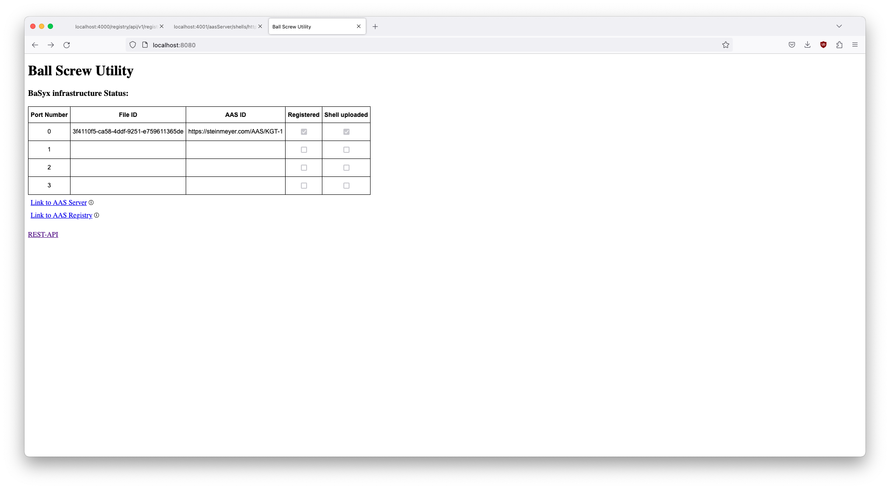
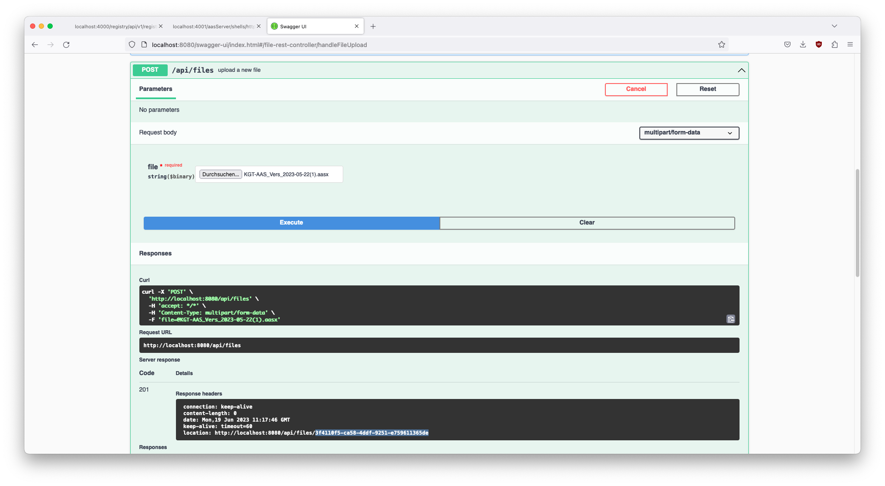
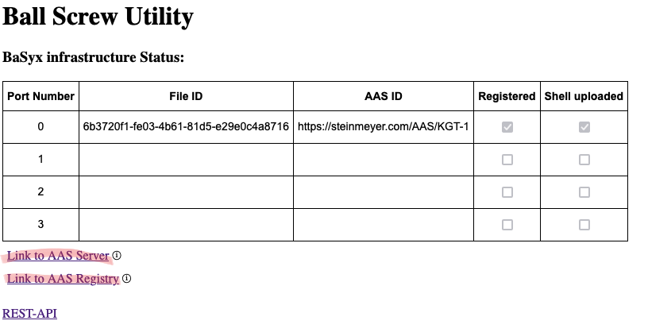

# BaSys KGT Management Application

Application for managing the BaSys integration of a Ball Screw.

Part of the BaSys4Maintain Satellite project.

Java / Spring-Boot Application.

The application can manage multiple ball-screws and register them with the BaSyx 4.0 infrastructure. A BaSyx AAS server and registry can also be started with the
applications included docker-compose file (see Installation & set-up). The management application can be used to manage the AAS of multiple ballscrews. This includes
registration and upload, deregistration and deletion, and forwarding health values from an external health-monitoring device.

# API

The OpenApi UI and documentation can be found at http://localhost:8080/swagger-ui/index.html when the server is running.

# Installation and set-up

## Requirements

- Docker (https://www.docker.com/)
- Internet connection (or pre-downloaded docker images)
- example AAS can be found in the AAS folder

## Set-up

1. open a terminal in the folder that contains docker-compose.yml
2. run maven build
2. execute docker compose -f docker-compose-dev.yml up
3. wait until everything is started up (check in docker desktop)

## Usage

1. go to http://localhost:8080 and click on REST-API to get to the API overview
2. upload an AASX file containing an administration shell vie the POST /api/files endpoint and take note of the file-id that is contained in the api response

3. map the uploaded file to a port via the POST /api/port/{portNumber} endpoint, by entering the appropriate portNumber and fileId from the previous step
4. register the AAS to the registry and upload to the AAS server via the GET /api/registration/register endpoint
5. optional: check localhost:4001 and localhost:4000 (or where ever your registry and aas server are running), you should see the AAS listed there
6. you can now use the POST /api/health/{portNumber} endpoint to write health values to the AAS. These will then be reflected in the Asset Administration shell hosted on the AAS server

---

## Known Issues
- **Broken Links:** Because Docker creates its own network on the host computer the URLs of the components are different on the host system from the URLs inside the Docker-containers. So while the AAS-server reaches the registry via http://registry:4000/registry you have to use http://localhost:4000/registry on the host system. As a consequence some links on the sites might not work.

*after clicking one of these links you might have to replace the host name with "localhost"*
